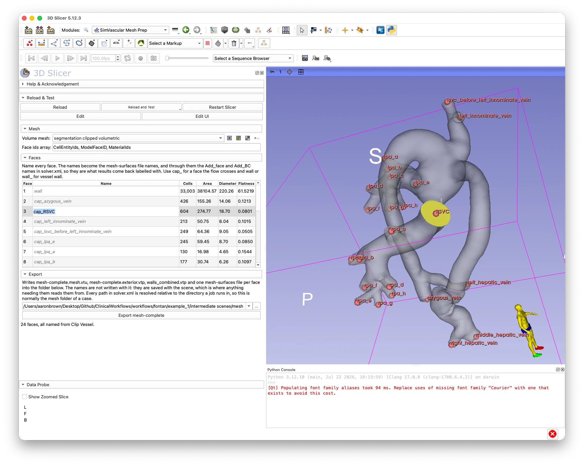

# SimVascular Mesh Prep

## Summary

Turns a face-labelled volume mesh into the `mesh-complete` folder that the
[svMultiPhysics](https://github.com/SimVascular/svMultiPhysics) solver reads, and lets you
name the faces on the way. The input is a volume mesh, typically one out of
[CFD Mesh Generator](https://github.com/vmtk/SlicerExtension-VMTK/blob/master/Docs/CfdMeshGenerator.md);
the output is a folder with the volume mesh and one file per named face, which the solver
binds its boundary conditions through.

If the surface was clipped with
[Clip Vessel](https://github.com/vmtk/SlicerExtension-VMTK/blob/master/Docs/ClipVessel.md),
the faces arrive already named after the clip points, so in most cases naming is a matter
of checking rather than typing.



*A Fontan geometry with its clip points named in Clip Vessel. In SimVascular Mesh Prep the
selected face (`cap_RSVC`) is highlighted in the 3D view, and the face names inherited
from the clip points are listed in the panel. **Export mesh-complete** writes the folder
for svMultiPhysics.*

## Tutorial

1. **Make a volume mesh.** In CFD Mesh Generator, mesh your capped surface with
   *Tetrahedralize* enabled (the solver needs a mesh with a single element type).
2. **Open SimVascular Mesh Prep** and select the volume mesh in **Mesh**. The face ids array
   is found automatically (`CellEntityIds`, `ModelFaceID` or `MaterialIds`).
3. **Find the faces.** Move the cursor over the mesh in the 3D view: the face under it is
   highlighted. Click it to select its row in the **Faces** table. The buttons beside the
   mesh selector toggle edges, colouring by face id, transparency and visibility, which
   helps when a cap is hidden behind the anatomy.
4. **Name the faces.** Type a name in the `Name` column of each row. Use `cap_<vessel>` for
   every inlet and outlet (each one gets its own boundary condition) and `wall` or
   `wall_<something>` for the vessel wall. Names become file names and boundary condition
   names in the solver, so pick ones you will want to read results under.
   - Names inherited from Clip Vessel appear **dimmed and italic**. Check them; typing over
     one replaces it, and clearing the cell brings the inherited name back. Renaming a clip
     point in Clip Vessel renames the face.
   - A name drawn **in red** is an inherited name whose face does not sit where its clip
     point is, so it may be on the wrong vessel. Hover over it for details, and type the
     correct name to resolve it.
5. **Check the caps.** The table lists each face's area, equivalent diameter and
   **flatness**, which is the largest distance of any point from the face's best-fit plane.
   A cleanly cut cap reads close to 0; a large value means it was not cut normal to the
   vessel.
6. **Export.** Choose the output folder (by default `mesh` next to the saved scene) and
   click **Export mesh-complete**. The button is enabled once every face has a name. The status line
   below the panel reports how many faces are named, inherited or still missing a name.

The names are saved on the mesh, so they come back when you reopen the scene and survive a
remesh in the same scene.

### What gets written

```
mesh/
  mesh-complete.mesh.vtu        the volume mesh
  mesh-complete.exterior.vtp    the whole boundary
  walls_combined.vtp            all wall faces merged
  mesh-surfaces/cap_RSVC.vtp    one file per named face
  mesh-surfaces/wall.vtp
  ...
```

### When export is refused

The module refuses to export a mesh that svMultiPhysics would misread without saying so:

- **Mixed element types**, for example tetrahedra with boundary-layer prisms. Enable
  *Tetrahedralize* in CFD Mesh Generator and remesh.
- **A face table that does not match the mesh**, for example a cap lost or renumbered by
  the mesher.
- **A boundary cell with no volume element behind it.**
- **More than one `ModelRegionID`** (multi-domain meshes are not supported yet).

## Running a simulation with svMultiPhysics

The exported folder is in the mesh format that
[svMultiPhysics](https://github.com/SimVascular/svMultiPhysics) requires. Setting up and running a
simulation from a graphical interface is under active development as part of the port of
SimVascular to Slicer; for now, the simulation is set up and run from a terminal.

1. **Install svMultiPhysics.** Follow the build or Docker instructions in its
   [README](https://github.com/SimVascular/svMultiPhysics#readme) so that the
   `svmultiphysics` command is available.
2. **Start from a test case.** The
   [test cases](https://github.com/SimVascular/svMultiPhysics/tree/main/tests/cases) are
   complete, working inputs. For blood flow,
   [`fluid/pipe_RCR_3d`](https://github.com/SimVascular/svMultiPhysics/tree/main/tests/cases/fluid/pipe_RCR_3d)
   (flow inlet, RCR outlet, rigid wall) is a good template. Copy its `solver.xml`, and any
   inflow file it uses, into a new case folder.
3. **Put the exported mesh next to it**, so the case looks like:

   ```
   my_case/
     solver.xml
     inflow.flow
     mesh/                  exported by SimVascular Mesh Prep
   ```

4. **Point `solver.xml` at the mesh.** In `<Add_mesh>`, set `Mesh_file_path` to
   `mesh/mesh-complete.mesh.vtu` and add one `<Add_face>` per file in
   `mesh/mesh-surfaces/`, using the face names you chose in Slicer:

   ```xml
   <Add_mesh name="msh">
     <Mesh_file_path> mesh/mesh-complete.mesh.vtu </Mesh_file_path>
     <Add_face name="cap_IVC">
       <Face_file_path> mesh/mesh-surfaces/cap_IVC.vtp </Face_file_path>
     </Add_face>
     <Add_face name="wall">
       <Face_file_path> mesh/mesh-surfaces/wall.vtp </Face_file_path>
     </Add_face>
     <!-- ... one per face ... -->
   </Add_mesh>
   ```

5. **Add a boundary condition for every face.** In `<Add_equation type="fluid">`, add one
   `<Add_BC name="...">` per face, with the same name as its `<Add_face>`: for example an
   unsteady flow (`Dir`) on the inlet, a resistance or `RCR` (`Neu`) on each outlet, and a
   zero velocity (`Dir`, `Steady`, value `0.0`) on the wall. Copy the blocks from the
   template and change the names and values. Then set the fluid properties, time step and
   number of steps for your case. The
   [svMultiPhysics documentation](https://simvascular.github.io/documentation/multi_physics.html)
   describes every parameter.
6. **Run it** from the case folder:

   ```sh
   mpiexec -np 4 svmultiphysics solver.xml
   ```

   The results are written to a `4-procs/` folder (one per number of processes).
7. **Look at the results.** Load the `result_*.vtu` files into a visualization tool such
   as [ParaView](https://www.paraview.org) to view velocity, pressure and wall shear
   stress on the mesh. The boundary integrals, such
   as `B_NS_Pressure_average.txt` and `B_NS_Velocity_flux.txt`, report pressure and flow
   for each face, under the names you gave it.

## Developers

### Why the mesh-complete format

A mesher hands back one grid holding the volume elements and the boundary cells they stand
on, every cell carrying a face id. svMultiPhysics reads a folder instead, and binds its
boundary conditions through two id arrays:

- `GlobalNodeID` is how a boundary condition is bound to the volume: each face file
  carries, per point, the id of the volume node it is, and the solver looks each one up.
- `GlobalElementID` on a face is the element behind each boundary cell, which is what the
  boundary term is integrated against.

No mesher writes any of this, which is why the translation is a step of its own. The same
reasoning explains the refusals above: a mixed-type mesh is read wrong because
svMultiPhysics decides a mesh's element type by counting cell types and taking the last
kind it found, so tetrahedra with boundary-layer prisms among them are read as all prisms,
six nodes to an element. A boundary cell standing against no volume element leaves the
solver nothing to integrate the boundary term against.

### Against SimVascular's own writer

The format is SimVascular's, so `svmeshcomplete` follows
[`sv4gui_MeshLegacyIO.cxx`](https://github.com/SimVascular/SimVascular/blob/master/Code/Source/sv4gui/Modules/Mesh/Common/sv4gui_MeshLegacyIO.cxx)'s
`WriteFiles` rather than inventing a compatible-looking format of its own.

The one semantic worth stating is the ids. SimVascular's `ResetFaceSurfaceIds` rewrites a
face's `GlobalNodeID` to `node_map[id] + 1` and its `GlobalElementID` to
`elem_map[id] + 1`, where those maps take an id to its *index* in the volume mesh's
arrays — so a face's ids are the 1-based positions of its nodes and its owning elements in
the volume mesh, which is what the solver looks them up as. SimVascular has to remap
because the mesher hands it ids it did not choose; here the ids are assigned over the
volume mesh's own points and cells, so the same invariant holds by construction.

Otherwise: faces are extracted by thresholding `ModelFaceID` with the points compacted,
as `PlyDtaUtils_GetFacePolyData` does; everything is written zlib-compressed, appended and
un-encoded, as SimVascular's writers are; and `walls_combined.vtp` is the wall faces
together. SimVascular appends its separately extracted faces and cleans them with point
merging, because extracting them separately duplicated the points along every seam; here
the wall cells come out of the exterior in one pass, so there is nothing to merge.

Two deliberate differences:

- **A wall in more than one piece.** SimVascular writes
  `walls_combined_connected_region_<j>.vtp` per piece *instead of* `walls_combined.vtp`.
  This writes those files too, and `walls_combined.vtp` as well, because a case config
  naming a file the export decided not to write fails at the solver rather than here. The
  panel says how many pieces there were, which is the part worth acting on.
- **More than one `ModelRegionID`.** SimVascular splits a multi-domain mesh into
  `<dir>_domain-<i>` folders. This refuses instead, rather than flattening the regions
  into one without saying so. A mesh carrying a single region keeps its id.

### Face ids array

Which cell array the face ids are read from, by the same rule CFD Mesh Generator uses: the
first of the names offered that the mesh carries. `CellEntityIds` is VMTK's name,
`ModelFaceID` is SimVascular's, and `MaterialIds` is Slicer's own material array.

That last one is in the default list, and last in it, because CFD Mesh Generator puts the
ids there: its own field uses the first name the *input surface* already carried, and its
widget prepends an integer cell array it finds on an input carrying neither of the others
— which a surface out of Clip Vessel is. A mesh built on one arrives labelled by
`MaterialIds` and is no less labelled for it, so there is nothing to set and nothing to
redo upstream.

Reading it cannot quietly mistake a real material array for face labels. A genuine one has
nonzero values on the volume elements and a face id array does not, so the export refuses
it and says so. Being last means a mesh carrying both is read by the name that means
faces.

Whichever array the input used, the exported files carry `ModelFaceID`, so the choice does
not reach anything downstream.

### Names inherited from the clip

The vessel names already exist upstream — they are the labels on the clip points in Clip
Vessel — and a name typed here is the same name typed a second time. So Clip Vessel records
on its output which of its clip points named each face, CFD Mesh Generator carries that
record onto the volume mesh, and this panel follows it.

What travels is three things on the mesh node: a `ClipPoints` node reference to the markups
node, and the attributes `ClipVessel.FaceIdToClipPointID` and `ClipVessel.WallFaceID`. Only
the pointer, never a copy of the labels. With no second copy there is nothing to go stale,
so renaming a clip point renames the face, live.

A control point label is free text and a face name is a file name, so the labels are put
through the same sanitizer the headless scripts use — `Outlet 1` becomes `cap_Outlet_1` —
and a case packaged from the panel and one packaged from a terminal name their files
identically. Two ends carrying the same label upstream, which Clip Vessel's positional
defaults make easy, are numbered apart (`cap_Outlet_1_3`, `cap_Outlet_1_7`) and reported in
the status line rather than refused: refusing would block an export on names nobody typed,
with nothing to fix in this panel.

**What you type is an override, not the name.** The panel resolves each face as *override,
or else inherited*, which buys three behaviours from one rule: rename a clip point upstream
and the face name follows; type a name and it sticks, whatever happens upstream afterwards;
clear the cell and the inherited name comes back, rather than the face going blank.

Inherited names are drawn dimmed because the risk of a name you did not choose is that it
looks exactly like one you did: `cap_Outlet_1`, read off Clip Vessel's positional default,
is indistinguishable from a considered name, and a boundary condition bound to it is bound
to whichever vessel happened to be fourteenth.

A face whose clip point has been deleted comes out **unnamed**, not renamed. This is why the
record is keyed by control point ID rather than by position in the list: a cap's face id is
`firstCapFaceId + clip point index`, so deleting a clip point shifts every later index down
one, and keyed by index each of those vessels' names would move quietly onto the face of the
vessel before it. Unnamed is a thing an operator can see; a plausible wrong name is not.

A mesh imported from elsewhere carries none of the record, and then every name is typed in
this panel.

### The wrong-vessel check

An inherited name is only as good as the record it came from, and a wrong record is the one
fault nothing else in the chain can see: the face ids are all on the mesh, each names a real
clip point, every name is unique and plausible. It has happened — CFD Mesh Generator's
boundary layer once rotated the cap ids, and on a clinical case 22 of 23 caps were named
after another vessel with nothing anywhere saying so.

So the panel asks the question ids cannot answer: is this cap where its clip point is? Each
face's centroid is matched to the clip point positions, one to one so that two faces cannot
both be attributed to the same end and hide a swap between them. A face that comes out
somewhere other than where the record puts it is drawn in red and counted in the status
line. Typing a name over it clears the complaint — an override is your own answer, and the
record no longer applies to that face.

It is advisory, not a refusal. A flow extension puts a cap at the tip of the extension rather
than at its clip point, which on a short branch in a crowded tree can read as a disagreement
when nothing is wrong. Being wrong the other way costs a boundary condition on the wrong
vessel, which is worth a false alarm or two.

### Persistence

Every name is saved on the mesh node, as the attribute `SimVascularMeshPrep.FaceNames` —
typed here or inherited, because that is where everything else reads them from: Export names
its files from them, and the workflow scripts that package a case from a terminal read them
off the saved scene without opening Slicer. They are matched to faces by id, so a remesh in
the same scene keeps them and only the measurements change. There is no file beside the mesh
to keep in step.

On the mesh rather than in the module's own settings, which are the *scene's*: a scene
holding a pre-op and a post-op anatomy has two face 4s, so one set of names for the scene
put a name you typed for one anatomy onto the other's face the moment you changed the mesh
in the selector. The face ids array and the output folder are still the scene's, as is which
mesh the panel was left open on.

A second attribute records which names were inherited, and those are worked out again from
the clip points on every load, so the saved copy never freezes a name against a rename
upstream. Where the clip is no longer in the scene to ask, the saved copy is what answers,
and the name is still shown as one nobody checked.

### Panel details

The display buttons beside the mesh selector are not checkable: a mark would be saying what
the display node holds, and nothing tells the panel when that changes elsewhere, so it would
sooner or later contradict the scene. Each reads the state at the moment it is pressed and
turns it around. Turning face colouring off leaves the mesh a slightly see-through neutral
grey rather than whatever colour its node was created with.

Hovering only shows; it leaves the selection alone, so the highlight goes back to the
selected row when the cursor leaves the mesh. A click at the end of a camera drag is
ignored, so rotating the view does not move the selection. The face under the cursor is
found by where the pick landed rather than by the cell id it also reports: that id indexes
the polydata the display pipeline built to draw the node, which for an unstructured grid
is not the grid's own cells.

### Outside Slicer

All of the geometry is in `svmeshcomplete`, the package beside this module, which imports
nothing from Slicer and is pip-installable on its own. `SimVascularMeshPrep.py` is an MRML
adapter: it reads the selected mesh node's grid, calls the package, and reports what it
wrote. A workflow packaging cases from a terminal calls the same functions and gets the same
folder.

That includes the naming rule. `face_table.names_from_labels` takes `{face_id: label}` and
returns the names, sanitized and with duplicates numbered apart, so a script that has labels
from anywhere — a clip points `.mrk.json`, a spreadsheet — reaches the same file names the
panel would. Only *following Clip Vessel's record* is the module's own, because that means
reading a node reference, which is MRML.
