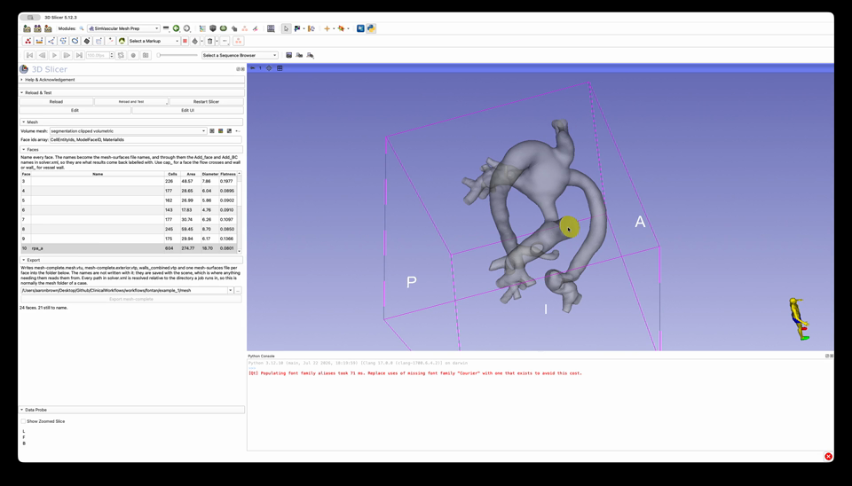

# SimVascular Mesh Prep

Name the faces of a volume mesh and write the `mesh-complete` folder an svMultiPhysics
case reads.

[](../Docs/SimVascularMeshPrep_demo.mp4)

**[▶ Play the demo](../Docs/SimVascularMeshPrep_demo.mp4)** (22 s, no sound) — a Fontan
mesh of 24 faces. The table measures every one; hovering a face in the 3D view shows it
on its own; clicking it selects its row and opens its name for typing. Export stays
greyed out while the status line still reads faces left to name.

## Why this is a step at all

A mesher hands back one grid: the volume elements, the boundary cells they stand on, and
a face id per cell. svMultiPhysics reads a folder — the volume elements alone under
`GlobalNodeID`/`GlobalElementID`, the exterior under `ModelFaceID`, and one file per named
face, which is what its boundary conditions bind to. No mesher writes any of that.

And between the two sits something nothing can do for you. A face id is a number; a
boundary condition is per vessel. Somebody has to say which cap is the azygous vein — and
the names they give become the `mesh-surfaces/` file names, the `Add_face` and `Add_BC`
names in `solver.xml`, and the labels every result comes back under.

```
mesh/
  mesh-complete.mesh.vtu        volume elements alone, GlobalNodeID + GlobalElementID
  mesh-complete.exterior.vtp    every boundary cell, with ModelFaceID
  walls_combined.vtp            the wall faces merged, for the no-slip condition
  mesh-surfaces/cap_RSVC.vtp    one file per named face
```

## Outside Slicer

The packaging is [`svmeshcomplete/`](svmeshcomplete), which imports numpy and VTK and
nothing else — both of which Slicer ships, so a binary install needs no pip step. It is
installable on its own so that a case prepared in this panel and a case prepared from a
terminal run one implementation:

```bash
python -m pip install -e .
python -m pytest Testing/Python     # 29 tests, no Slicer needed
```

## Full documentation

[Docs/SimVascularMeshPrep.md](../Docs/SimVascularMeshPrep.md) — the panel control by
control, what the three checks refuse and why each is silent corruption in the solver
otherwise, how this follows SimVascular's own `sv4gui_MeshLegacyIO.cxx`, and what
flatness measures.
